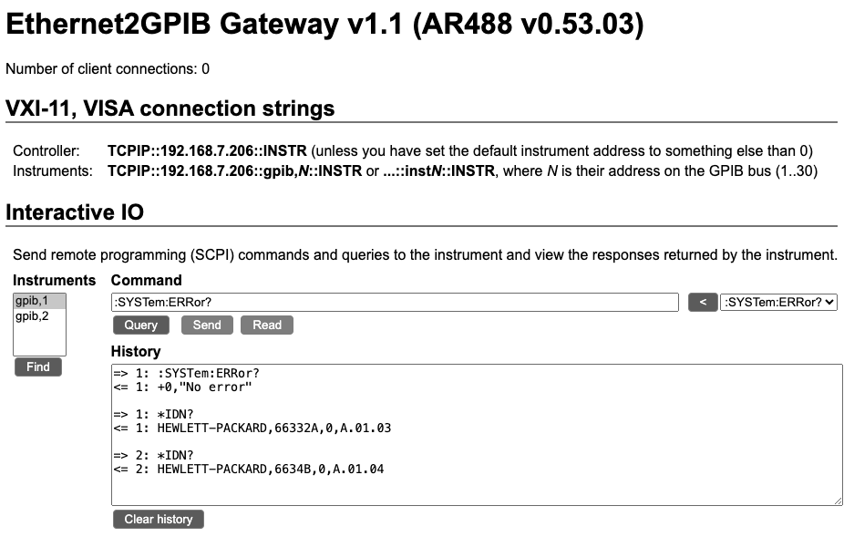

# PoE Ethernet GPIB Adapter, with Prologix or VXI-11.2

## PoE-powered GPIB Adapter with Ethernet and USB-C Support

<a href="Img/adapter_connected.png" target="_blank">
    
</a>

The **PoE Ethernet GPIB Adapter** is designed to interface test equipment with GPIB / HPIB / IEEE-488 interfaces.

The primary goal of this project is to provide an easy solution to connect multiple GPIB-equipped instruments over Ethernet without excessive cabling. It can, at choice, use the Prologix protocol or support VXI-11.2 (VISA).

---

## Why?

The motivation behind this project comes from the challenges of using several generations of instruments with GPIB interfaces. In theory, only one GPIB master is needed, and up to 20+ instruments can be connected in any order using suitable GPIB cabling. However, there are drawbacks:

- Instruments must be fully compliant with the IEEE-488 standard. Many older instruments, predating the standard, do not comply. The main issue is that the bus does not go Hi-Z when off, requiring certain instruments to be powered on even if you're only using another device.
- GPIB cabling is bulky and expensive. While used options can sometimes be found, the overall cost remains high.

At work, this has been solved elegantly using commercial Ethernet adapters, each assigned an address and connected directly to the instrument. However, these adapters are priced around $500 USD—far from hobbyist-friendly. My initial solution was to buy one adapter and rely on daisy-chaining, but as my instrument collection grew to 20 devices requiring GPIB, this approach was no longer practical. Hence, the **PoE Ethernet GPIB Adapter** was born.

---

## Design Criteria

1. Lower cost: Total BOM should be less than 50 USD.
2. Support Power over Ethernet (PoE) to minimize cable clutter.
3. Include USB-C power as an alternative if PoE is unavailable.
4. Enable GPIB communication over both Ethernet and USB-C interfaces.
5. Use the same communication protocol as existing commercial units.
6. Minimize radiated and conducted noise to avoid interference in test environments.
7. Include a simple, easy-to-print 3D-printed enclosure to keep costs low.

---

## Results

All design goals have been met[^2]. The current unit price is approximately $45 USD when ordering parts for 20 units. Prices increase for smaller batch sizes.

[^2]: GPIB commands over USB-C is Work In Progress.

In my home lab, I assign each device a static IP address based on its MAC address and run a local DNS server to provide easy-to-remember domain names, making the adapter simple and intuitive to use.

Project's documentation:

- [Design Documentation](docs/dn.md)
- [Design Test Documentation](docs/dt.md)

---

## VXI-11 or Prologix

This code can produce either a VXI-11.2 device, or a Prologix device (the ROM is not big enough for both at the same time, although the code is compatible with cohabitation). Switching between VXI-11 and Prologix is done at compile time. If compiler option `-DINTERFACE_PROLOGIX` is used, the firmware produced is for Prologix.

VXI-11.2 allows discovery over the network, and uses the following VISA connection strings:

- Controller[^1]: `TCPIP::{IP address}::INSTR` (unless you have set the default instrument address to something else than 0)
- Instruments: `TCPIP::{IP address}::gpibY,N::INSTR` or `TCPIP::{IP address}::instN::INSTR` (and even the legacy form `TCPIP::{IP address}::hpibY,N::INSTR`), all where `N` is their address on the GPIB bus (1..30), and `Y` is simply ignored.

Example: `TCPIP::192.168.7.105::gpib,2::INSTR` for instrument with GPIB address 2 on the gateway having IP address 192.168.7.105.

[^1]: controller, gateway, adapter: different names for the same.

### VXI-11.2 compatibility

With the limited resources, this device is meant to work with the most common tools, like for example pyVisa. It is not a full implementation, and lacks the following advanced features (for now):

- secondary instrument addresses
- async VXI-11 operations
- instrument locking via VXI-11
- VXI-11 interrupts
- the VXI-11 abort channel
- authentication via VXI-11
- control of timeouts. The gateway uses preset timeouts.
- terminating character control. It now only supports reading on eoi, and will ignore any requested terminating character.

It is discoverable via UDP, but there is no publication via mDNS (yet).

Not all of the above will be possible with the limited resources the device has, but let us know if you encounter any problems, and we'll look if it is possible to make the implementation more complete.

Some remarks on specific commands:

- Read Status Byte (pyvisa: `inst.read_stb()`):
  - only if you address the controller itself, it will return a valid status byte. The operation is not supported on the connected instruments.The prologix interface has the same limitation.
- Device Clear (pyvisa: `inst.clear()`):
  - if sent to the controller, it is NOT interpreted as a universal device clear (all devices on the bus), but a clear of the controller: all connected devices will be returned to local control and the bus will go idle.
  - if sent to an instrument, only that instrument will be cleared. Depending on the instrument, it may reset or not, and may take a significant amount of time.
- While it is in theory possible to support "Go to local/remote" commands, neither pyvisa nor LabView support it properly on VXI-11 devices, so it is not implemented. See Device Clear above.

### The number of instruments you can connect

The GPIB bus protocol itself allows up to 30 instruments. This does not mean you can effectively control 30 instruments via the gateway, as the gateway device has its electrical limits, depending on the length of the cables and instruments themselves. And also the software has its limits:

The Prologix service will allow only 1 client software connection and will allow you to interact with only 1 instrument at any given time: you must switch between the instruments you want to address.

The VXI-11 service will allow you to set up multiple instrument connections at the same time. It will allow your client software to be easier to set up and maintain, and will make it easier to interact with multiple instruments, whether they are connected to the gateway or not. There is a however a limit to the number of open connections to the gateway:

- up to 4 instruments: no restriction
- 5 instruments: only if you do not use the web server
- 6 instruments: only if you disable the web server (use the compile option `-DDISABLE_WEB_SERVER`)
- 7 or more: not possible via VXI-11

This does not mean that you cannot physically connect more instruments to the gateway, it just means that you cannot connect to more of them, via your client software, *at the same time*. Additional connections should fail to connect and fall in timeout, existing connections will not be closed.

Also, be aware that the GPIB bus is a shared bus. Even if you have connected to multiple instruments, you might encounter problems if you run multiple commands or queries *at the same time*, via for example multiprocessing or threading.

### Large replies or large requests

Both VXI-11 and prologix support large replies and large commands and requests. Although the gateway supports it, be aware that instruments themselves often have rather low limits with regards to the the size of the commands and requests. Often it is best to send commands one at a time.

Know that if you use VXI-11 and pyvisa, you may need to set the `instr.chunk_size` to a higher value if you use very large replies, and you get a `VI_ERROR_INV_PROT` error.

### Prologix and pyvisa

Support for prologix in pyvisa has been pending since a long time, and are not well documented. There are 2 main possibilities:

- You can fake the prologix service as being a raw socket service (ex `TCPIP::192.168.7.206::1234::SOCKET`), and then mix the SCPI commands with the correct `++` commands. This might be the most robust for now, but requires more work on the user side.
- or use constructions like this (not well documented yet with pyvisa, and you need a recent version of pyvisa):

```python
import pyvisa
rm = pyvisa.ResourceManager()
prlgx = rm.open_resource("PRLGX-TCPIP::192.168.7.206::INTFC")  # This is the gateway, and pyvisa will pick port 1234 automatically. It will propose itself as a native GPIB interface, so you can't also have a GPIB card in your system
inst1 = rm.open_resource("GPIB::1::INSTR")  # instrument at address 1
inst2 = rm.open_resource("GPIB::2::INSTR")  # etc
inst18 = rm.open_resource("GPIB::18::INSTR")
# and now you can talk to the instruments (one at a time please):
print(inst1.query("*IDN?"))
print(inst2.query("*IDN?"))
print(inst18.query("*ID?"))
```

If you use this method, be aware that pyvisa tries to be intelligent, and emits the `++read eoi` itself command when you do a query. But you can no longer emit that yourself. That means that you can no longer call `read_raw` or other standalone read methods. Only use `query...` and `write` methods.

---

## The User Interface of the device

There are 3 parts:

- the **LED**. It indicates different states:
  - blue solid for waiting for DHCP
  - red solid for error in network or DHCP
  - red single flash when the assigned IP address changes
  - green slow flashing for idle
  - green/blue faster flashing when clients are connected
- the **serial console** (via USB): This console shows startup information, ports used, and has a small menu.
- the **Web Server** (on port 80): it shows some help texts, the number of connected clients, and allows interaction with any of the connected instruments. The web server is however only available with the VXI-11 service, as Prologix does not leave enough ROM space available.

### The serial menu

This menu is rather basic. Be aware that it requires 'enter' for each command.

It has the following options:

- Setting of IP address. By default, the device starts with DHCP. You can however force a fixed IP address.
- Setting of the default instrument address (only with VXI-11, as Prologix has its own command for that). The default is 0, meaning: the gateway itself. If you only have 1 instrument connected, or want to designate a "preferred" instrument, you can set it to the address of any instrument on the bus. That way, the gateway becomes transparent, and you can use the default (and the discoverable) VISA connection string to address that instrument.

### The Web server

The web server is available only when using the VXI-11 interface.

An example of the web page is shown below:

<kbd>

</kbd>

Explanation of the buttons:

* <kbd>Find</kbd>: scan the GPIB bus for instruments
* <kbd>&lt;</kbd>: populate the Command field with one of the standard commands from the drop down list
* <kbd>Query</kbd>: Query the selected instrument. This is the same as a Send followed by a Read provided the command ends with a "?". This is also executed when pressing the "enter" key while entering data in the command text field.
* <kbd>Send</kbd>: Send command to the selected instrument.
* <kbd>Read</kbd>: Read from the selected instrument.
* <kbd>Clear history</kbd>: clear the contents of history.

Do not interact with the instruments via the web interface while you also interact with the instruments from the VXI interface.

---

## Project files

Latest version is avaiable under [Releases](https://github.com/Kofen/PoE_Ethernet_GPIB_Adapter/releases)

And all the source code for all the parts should be in their respective folders in the repro. If anything is missing, let me know!

## How to compile and how to flash

The easiest is compilation with PlatformIO, from the [SW](/SW) directory. There are separate targets for the VXI-11 and Prologix versions.

See [SW/README.md](SW/README.md) for more information.

## License

This project is licensed under the GPL V3. See the [LICENSE](LICENSE) file for details.

## Release notes

- 2.3:
  - Improved VXI-11 completeness:
    - Device Clear
    - Read Status Byte (only for the controller itself)
- 2.2:
  - Fixes and improvements to VXI-11.2 implementation, especially regarding large reads. Improved compatibility with older instruments.
  - Solved communication issues with certain instruments that have weak or absent pullups on the GPIB bus.
  - Backend updated to AR488 0.53.39
  - The web server had to be removed when using the Prologix interface (ROM size limitation). It is still available when using VXI-11.2.
  - Improved debugging information on serial console, when activated
- 2.1:
  - Improvements to VXI-11.2 implementation, especially regarding large reads.
- 2.0:
  - Added support for VXI-11.2
  - Added interactive web interface (only for VXI-11.2)
  - Backend updated to AR488 0.53.03
- 1.0:
  - First public version

## Acknowledgements

- A huge thanks to the [AR488 project](https://github.com/Twilight-Logic/AR488), run by [Twilight-Logic](https://github.com/Twilight-Logic) and its community contributors. The current software is a fork of AR488. For more information about this, see [here](SW/README.md).
- The VXI-11 driver is partially inherited from [espBode](https://github.com/awakephd/espBode), and went through various evolutions before arriving here.
